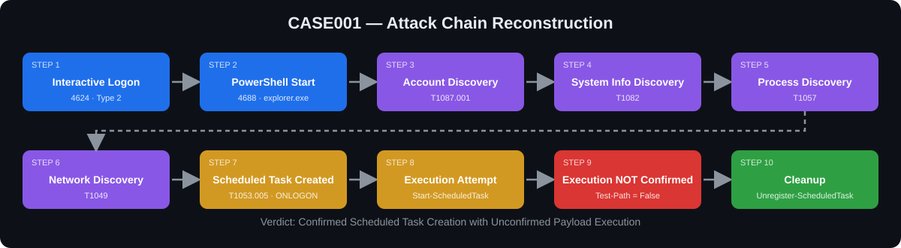
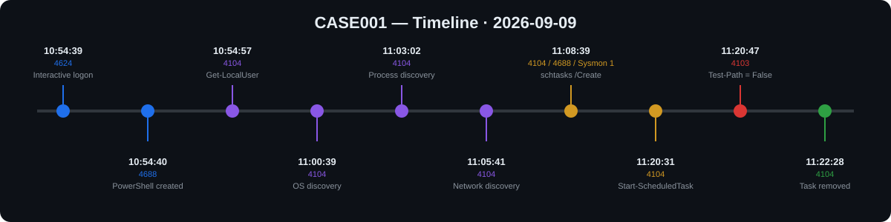

[README (1).md](https://github.com/user-attachments/files/32862104/README.1.md)
<div align="center">

# CASE001 — Windows DFIR Investigation

**Scheduled Task Persistence Reconstruction using Splunk, Sysmon & PowerShell Logging**


</div>

---

## Overview

This case reconstructs a full activity chain on a Windows 11 endpoint using three telemetry sources correlated in Splunk: **Windows Security**, **PowerShell Script Block / Module logging**, and **Sysmon**.

The activity starts with a local interactive logon, moves through PowerShell-based discovery, and ends with the creation, execution attempt and removal of a logon-triggered Scheduled Task. The investigation also shows how to avoid over-claiming: the task was created, but payload execution could **not** be confirmed.

| Field | Value |
|---|---|
| Case ID | CASE001 |
| Date | 09 September 2026 |
| Host | `DESKTOP-U434GBI` (Windows 11 Pro, Build 26200) |
| Account | `DESKTOP-U434GBI\leader Resilient` |
| Evidence source | Splunk (`resilient_windows_security`, `resilient_windows_powershell`, `resilient_windows_sysmon`) |
| Environment | Home lab, controlled test activity |

## Key Findings

| Finding | Status |
|---|---|
| Interactive local logon (Type 2, source `::1`) | ✅ CONFIRMED |
| PowerShell launched from `explorer.exe` | ✅ CONFIRMED |
| Account / system / process / network discovery | ✅ CONFIRMED |
| Scheduled Task `CASE001_TestPersistence` created (`ONLOGON`) | ✅ CONFIRMED |
| Task creation correlated across 3 sources | ✅ CONFIRMED |
| Execution attempt (`Start-ScheduledTask`) | ✅ CONFIRMED |
| Successful payload execution | ❌ NOT CONFIRMED |
| Payload file `C:\Users\Public\CASE001_PERSISTENCE.txt` | ❌ NOT OBSERVED |
| External attacker involvement | ❌ NOT ESTABLISHED |
| Cleanup (task removed) | ✅ CONFIRMED |

**Classification:** *Confirmed Scheduled Task Creation with Unconfirmed Payload Execution*

---

## Attack Chain

<p align="center">
  
</p>

## Timeline (2026-09-09)

<p align="center">
  
</p>

Full timeline with assessments: [`02_Timeline/CASE001_Timeline.csv`](02_Timeline/CASE001_Timeline.csv)

---

## 🛡️ MITRE ATT&CK Mapping

| Technique | Name | Observed activity | Evidence |
|---|---|---|---|
| T1087.001 | Account Discovery: Local Account | `Get-LocalUser` | PowerShell 4104 |
| T1082 | System Information Discovery | `Get-CimInstance Win32_OperatingSystem` | PowerShell 4104 |
| T1057 | Process Discovery | `Get-Process` | PowerShell 4104 |
| T1049 | System Network Connections Discovery | `Get-NetTCPConnection` | PowerShell 4104 |
| T1053.005 | Scheduled Task/Job: Scheduled Task | `schtasks /Create ... /SC ONLOGON` | PowerShell 4104, Security 4688, Sysmon 1 |

---

## Evidence Walkthrough

### 1. Interactive logon: Security 4624
Logon Type 2 from `::1` (IPv6 loopback) shows the session started locally, not from a remote source.

| Time | Source | Event | Account |
|---|---|---|---|
| 10:54:39.073 | Windows Security | 4624, Logon Type 2 | `DESKTOP-U434GBI\leader Resilient` |

### 2. PowerShell process creation: Security 4688
PowerShell was spawned by `explorer.exe`, meaning it was launched from the interactive desktop session about one second after the logon.

```text
New Process : C:\Windows\System32\WindowsPowerShell\v1.0\powershell.exe
Parent      : C:\Windows\explorer.exe
```

### 3. Discovery commands: PowerShell 4104
Four discovery commands recorded by Script Block Logging.

| Time | Command | Technique |
|---|---|---|
| 10:54:57 | `Get-LocalUser` | T1087.001 |
| 11:00:39 | `Get-CimInstance Win32_OperatingSystem \| Select-Object Caption, Version, BuildNumber, CSName` | T1082 |
| 11:03:02 | `Get-Process \| Select-Object -First 20 Name, Id, CPU` | T1057 |
| 11:05:41 | `Get-NetTCPConnection \| Select-Object -First 20 LocalAddress,LocalPort,RemoteAddress,RemotePort,State` | T1049 |

The observed connections alone do not establish command-and-control activity, so they were not classified as malicious.

### 4. Scheduled Task creation: PowerShell 4104
The full `schtasks /Create` command line, including the `ONLOGON` trigger.

```text
schtasks /Create /TN "CASE001_TestPersistence" /TR "cmd.exe /c echo CASE001_PERSISTENCE_TEST > C:\Users\Public\CASE001_PERSISTENCE.txt" /SC ONLOGON /F
```

| Property | Value |
|---|---|
| Task name | `CASE001_TestPersistence` |
| Trigger | `ONLOGON` |
| Action | `cmd.exe /c echo CASE001_PERSISTENCE_TEST > C:\Users\Public\CASE001_PERSISTENCE.txt` |
| Run level | `LeastPrivilege` |
| Task file | `C:\Windows\System32\Tasks\CASE001_TestPersistence` |

### 5. Cross-source correlation: Security 4688 + Sysmon 1
The same `schtasks.exe` execution seen by three independent sources within about 140 ms.

| Time | Source | Event |
|---|---|---|
| 11:08:39.473 | PowerShell | 4104, `schtasks /Create` |
| 11:08:39.556 | Security | 4688, `schtasks.exe` |
| 11:08:39.616 | Sysmon | 1, `schtasks.exe` (parent `powershell.exe`, PID 5520) |

### 6. Execution attempt: PowerShell 4104
```text
Start-ScheduledTask -TaskName "CASE001_TestPersistence"
```

### 7. Task result: `Get-ScheduledTaskInfo`
```text
LastRunTime        : 11/30/1999 12:00:00 AM
LastTaskResult     : 267011
NumberOfMissedRuns : 0
```
`267011` equals `0x00041303` (`SCHED_S_TASK_HAS_NOT_YET_RUN`), and `11/30/1999` is the placeholder for "no recorded run".

### 8. Payload verification: `Test-Path`
```text
Test-Path "C:\Users\Public\CASE001_PERSISTENCE.txt"
False
```
The expected output file does not exist.

### 9. Cleanup
```text
Unregister-ScheduledTask -TaskName "CASE001_TestPersistence" -Confirm:$false
```
A follow-up `Get-ScheduledTask` returned a "no scheduled task found" error, confirming removal.

---

## Splunk Queries

| # | Purpose | File |
|---|---|---|
| 01 | Interactive logon (4624, Type 2) | [`01_Interactive_Logon.spl`](03_Splunk_Queries/01_Interactive_Logon.spl) |
| 02 | PowerShell process creation (4688) | [`02_PowerShell_Execution.spl`](03_Splunk_Queries/02_PowerShell_Execution.spl) |
| 03 | Discovery commands (4104) | [`03_Discovery_Activity.spl`](03_Splunk_Queries/03_Discovery_Activity.spl) |
| 04 | Scheduled Task creation | [`04_Scheduled_Task_Creation.spl`](03_Splunk_Queries/04_Scheduled_Task_Creation.spl) |
| 05 | Task execution attempt | [`05_Task_Execution.spl`](03_Splunk_Queries/05_Task_Execution.spl) |
| 06 | Cleanup | [`06_Cleanup.spl`](03_Splunk_Queries/06_Cleanup.spl) |

Example, task creation:

```spl
index=resilient_windows_powershell EventCode=4104 "schtasks /Create" "CASE001_TestPersistence"
| table _time ScriptBlockText
| sort _time
```

---

## 📁 Repository Structure

```text
.
├── README.md
├── assets/                 # attack flow + timeline graphics
├── 01_Report/              # full DFIR report
├── 02_Timeline/            # timeline CSV
├── 03_Splunk_Queries/      # SPL queries used
├── 05_Evidence/            # evidence scope and summary
└── 06_Hashes/              # SHA-256 integrity list
```

## Integrity

```bash
sha256sum -c 06_Hashes/SHA256SUMS.txt
```

## Skills Demonstrated

`Windows DFIR` · `Splunk SPL` · `Sysmon` · `PowerShell Logging (4103/4104)` · `Windows Security Events (4624/4688)` · `Cross-source correlation` · `MITRE ATT&CK mapping` · `Evidence-based reporting`

## Full Report

[`01_Report/CASE001_Final_DFIR_Report.md`](01_Report/CASE001_Final_DFIR_Report.md)

---

<div align="center">
<sub>Part of the <b>Resilient SOC</b> case file series · Lab activity only, no real-world victim data</sub>
</div>
